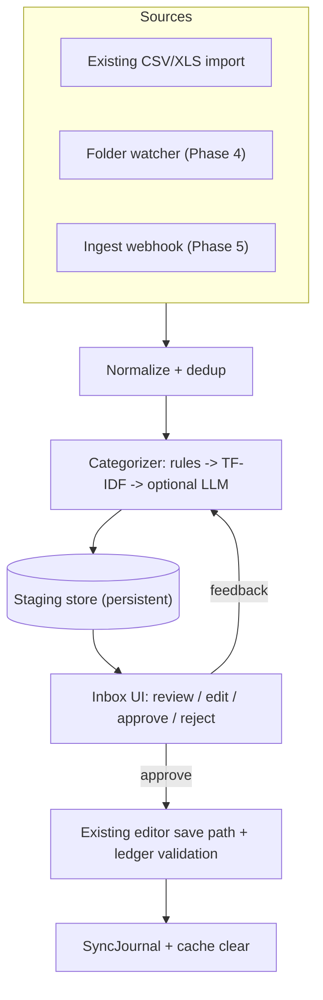

# Automated Ingestion & Smart Categorization — Implementation Plan (v3)

Status: draft, revised after review. Nothing here is implemented yet.
File paths and names are proposals and must be verified against the codebase when each phase starts.

---

## 1. Goals and Invariants

Reduce the manual work of keeping the journal current, without weakening Paisa's manifesto (data ownership, privacy).

1. **Local-first.** No financial data leaves the machine. Categorization in the core product uses rules, history and TF-IDF only, with no external services.
2. **Staging barrier.** Automated sources never write to the journal directly. Items land in a staging queue and need approval.
3. **Journal is the source of truth.** Approved items are written through the existing editor save path, which validates the result with the ledger CLI and rolls back on failure.
4. **Every phase ships on its own.** The product is useful after Phase 1, and the core stays light: no LLM, no new heavy dependencies.
5. **Suggestions are advisory.** Suggestions never set amounts or dates, never create accounts, and auto-approve is off by default.

## 2. Out of Scope (and why)

- **Cloud LLM providers.** Conflicts with the privacy invariant.
- **A bundled or managed LLM.** No model downloads, process management or heavy dependency in the core product.
- **IMAP email ingestion.** Deferred indefinitely (credential handling is the hard part).

## 3. Architecture

## 4. Key Design Decisions

### 4.1 Staging storage must survive cache rebuilds (decided: separate file)
Paisa's SQLite DB is treated as a rebuildable cache. Staging data is user state, so it does not go in the main DB.
- **Decision:** pending/rejected staging items live in a separate plain-text file (JSON Lines, e.g. `inbox.staging.jsonl`) next to the journal. It is diffable, can be committed to version control, and is never touched by `SyncJournal` or DB resets.
- The file path is configurable alongside the inbox journal (see 4.8).
- Staged items are loaded into memory (or a throwaway index) for the UI. Writes are atomic (write temp file, then rename).
- Optional performance mirror: staged items may also be copied into the cache DB for fast queries. The file stays authoritative, the mirror is rebuilt from it after any sync or reset, and no state exists only in the DB.
- Add a test that a full re-sync and a DB reset do not delete staged items.

### 4.2 Staged item model
Model the entry as a balanced pair, not a single "category":
- `id`, `source`, `fingerprint` (unique), `date`, `raw_description`, `clean_payee`
- `amount` (decimal), `currency`, `direction` (debit/credit)
- `source_account` (the account the statement belongs to)
- `suggested_account`, `suggestion_origin` (rule | history | tfidf | llm), `confidence`
- `is_transfer` flag (covers card payments and account-to-account moves)
- `status`: pending | approved | rejected | ignored
- `created_at`, `decided_at`, `decision_note`

Splits are out of scope for v1 (edit in the editor after approval).

### 4.3 Idempotency and dedup
- Fingerprint = hash of date + signed amount + source account + normalized description, plus an occurrence index to handle identical same-day transactions.
- Rejected and ignored items keep their fingerprint, so re-importing a statement never resurrects them.
- Compare against existing postings with a small date window and exact amount, and flag likely duplicates instead of silently dropping them.

### 4.4 Confidence and auto-approve
- LLM self-reported confidence is not calibrated and is not used.
- Confidence comes from: exact rule match (1.0), exact historical payee-to-account match, TF-IDF similarity, and agreement between TF-IDF and LLM.
- Auto-approve is **off by default**. When enabled, it applies only to user rules and exact historical matches. LLM-only suggestions always need a human.

### 4.5 LLM usage (deferred, Phase 6 only)
Kept as design notes in case Phase 3 metrics justify it.
- Run asynchronously through the existing persistent job queue. No synchronous calls in the request path.
- Pre-filter candidates with TF-IDF to the top ~15 accounts, then ask the model to choose among them. This cuts latency and improves accuracy.
- Constrain the output with a JSON schema / grammar so it can only return one of the candidate accounts or "unknown".
- Treat the payee text strictly as data. Never include raw email or SMS bodies in prompts.
- Expect seconds per item on CPU. Do not promise millisecond latency.
- If the server is unreachable, fall back to TF-IDF only and show a status indicator.

### 4.6 Privacy handling
- Strip account numbers, card numbers, phone numbers, VPAs and reference IDs from text before it reaches the model, even though inference is local (logs, crash dumps and future providers).
- Log decisions (what, when, which tier), never the raw statement text.

### 4.7 Webhook security (Phase 5)
- A dedicated ingest token, stored hashed, scoped to the ingest endpoint only.
- Its own rate limit, separate from the 6-requests-per-minute write limit.
- Default to localhost binding. LAN use requires TLS or a VPN, and the docs must say so.
- Reject unknown fields, cap payload size, and validate every field.

### 4.8 Writing to the journal
- Reuse the editor save path. Do not build a second writer.
- Decide the destination file explicitly: a configurable `inbox_journal` setting in `paisa.yaml`, defaulting to a dedicated `inbox.ledger` (extension follows the dialect) in the journal directory. It is a separate file so the user can review, commit and version-control it, and later move entries into their main journals.
- Validate with the ledger CLI after writing, and roll back the file on failure.
- Support ledger, hledger and beancount formatting, each with a fixture test.

## 5. Phases

### Phase 0 — Groundwork (small)
- Verify against the code: how the editor save path and journal inclusion work, and where the config for `inbox_journal` and the staging file path should live.
- Confirm the staging file survives sync and DB reset (the location decision itself is made, see 4.1).
- Write a short privacy section for the docs.
- **Exit:** decisions recorded in this document.

### Phase 1 — Staging inbox with manual approval (no AI)
- Staging model, migration and repository (4.1, 4.2).
- Fingerprint and dedup (4.3).
- API: list, approve, reject, edit suggested account, batch approve.
- Feed it from the **existing CSV/XLS import** (add a "send to inbox" option beside direct import).
- UI: `/ledger/inbox` with list, inline account edit, duplicate warnings, plain-text preview of the entry, keyboard shortcuts, Navbar pending-count badge.
- Approval writes through the editor save path (4.8).
- **Tests:** dedup and idempotency, staging survives re-sync, journal write and rollback, per-dialect formatting.
- **Exit:** user can import a statement, review it, and approve it into the journal.

### Phase 2 — Rule and history-based categorization (no LLM)
- Backend TF-IDF scoring (the current implementation only builds an index for the frontend, so scoring must be written).
- Exact historical payee matching and user-defined rules.
- "Remember as rule" on approval, and learning from corrections.
- Confidence from section 4.4, with optional auto-approve restricted as described.
- **Tests:** scoring against fixture postings, rule precedence, correction feedback.
- **Exit:** most recurring transactions arrive pre-categorized.

### Phase 3 — Lightweight categorization improvements (no LLM)
- Payee normalization: strip POS prefixes, reference numbers and city suffixes so the same merchant always matches.
- Transfer and card-payment detection from the user's own account names and common patterns.
- Recurring-transaction awareness using Paisa's existing recurring detection (same payee and amount each month gets the same account).
- Counters for how often each tier decides, so we can measure what is left uncategorized.
- **Tests:** normalization fixtures, transfer detection, recurring match.
- **Exit:** a measurable "uncategorized rate" that informs whether Phase 6 LLM work is justified.

### Phase 4 — Folder watcher
- Watch a configured inbox directory and run the existing import templates on dropped files.
- Debounce partially written files, move processed files to a `processed/` subfolder, and report parse failures in the inbox.
- Confirm behavior in the Wails desktop build.

### Phase 5 — Webhook ingest
- Endpoint and token handling per 4.7, accepting the same staged item shape.
- Documentation with example forwarder setups.

### Phase 6 — Optional / future (only if real usage shows a need)
- **Local LLM suggestions (deferred).** Only worth building if Phase 2 leaves a large share of items uncategorized. Design notes are kept in section 4.5. It would be an opt-in, advisory, asynchronous add-on talking to a user-run `llama-server` or Ollama over HTTP, adding no dependency to the core build.
- Split transactions in the inbox.

## 6. Cross-Cutting Requirements
- Update `CHANGELOG.md` with each phase.
- Add the nearest focused test for each behavior change, and regression fixtures per dialect (`inr`, `eur`, hledger, beancount).
- Run `gofmt`, scoped `go test`, Prettier, and `npm run check` on touched files.
- Add reference docs for the inbox, the config block and the privacy model.
- Keep an audit log of staged, approved and rejected items (metadata only).

## 7. Risks and Mitigations

| Risk | Mitigation |
| :--- | :--- |
| Staged data lost on re-sync | Phase 0 verification, dedicated store, re-sync test |
| Wrong auto-categorization written to journal | Approval required, auto-approve off by default, never LLM-only |
| Prompt injection via payee text | Data-only prompts, constrained output, advisory role |
| Slow LLM on CPU | Async jobs, candidate pre-filtering, TF-IDF fallback |
| Journal corruption on write | Existing save path, ledger validation, rollback |
| Webhook abuse | Scoped hashed token, own rate limit, localhost default, payload limits |
| Scope creep | Phases ship independently, optional features last |

## 8. Decisions Recorded
1. Approved entries go to a configurable `inbox_journal`, default `inbox.<ext>` per dialect (`inbox.ledger`, `inbox.journal`, `inbox.beancount`).
2. The staging file (JSON Lines) is the source of truth for staging, kept outside the main DB so it can be version-controlled. A read-only mirror in the cache DB is allowed for performance, but it must be rebuildable from the file and never be the only copy.
3. IMAP is out of scope for now.
4. The inbox journal is not included automatically. The docs and the UI tell the user they can `include` it from their main journal if they want its entries to sync into Paisa's reports automatically. Until then, approved entries only appear in the inbox file.
5. The docs recommend adding `inbox.staging.jsonl` to `.gitignore`, since it holds raw bank text. The inbox journal itself is meant to be committed.

## 9. Open Questions
None blocking. Sample statements from the user's bank are welcome as test fixtures.
