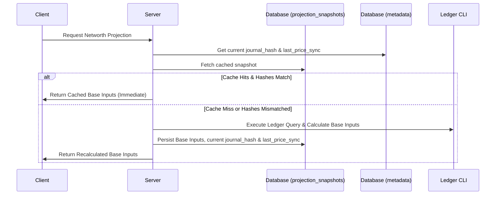

# Walkthrough - Net Worth Projection On-Demand Caching & Timezone Fixes

We have completed the implementation of the new personal finance roadmap projection features, default rates updates, base-inputs caching mechanisms, documentation, and resolved the timezone flakiness to achieve a 100% green test suite.

---

## 1. Changes Made

### 📖 Reference Documentation
- **[docs/reference/assets.md](file:///e:/Development/paisa/docs/reference/assets.md)**
  - Added a detailed description of the projection calculation methodology:
    - **Annual Expenses Calculation:** 12-month rolling expenses excluding taxes, scaled to 12 months.
    - **Monthly Contribution Calculation:** Derived from historical `Assets:%` postings, excluding checking accounts and liabilities, utilizing the derived savings rate when positive.
    - **CAGRs:** Set the default conservative (6%), expected (9%), and optimistic (12%) interest thresholds.

### ⚙️ Backend Logic & Caching
- **[internal/server/networth_projection.go](file:///e:/Development/paisa/internal/server/networth_projection.go)**
  - Updated default returns from 8%, 12%, and 16% to **6%**, **9%**, and **12%** to match the new conservative, expected, and optimistic defaults.
- **[internal/model/projection_snapshot/projection_snapshot.go](file:///e:/Development/paisa/internal/model/projection_snapshot/projection_snapshot.go)**
  - Added new synchronization columns `JournalHash` and `LastPriceSync` to the SQLite projection cache table definition.
  - Bumped `SchemaVersion` to `2`.
- **[internal/model/migration/migration.go](file:///e:/Development/paisa/internal/model/migration/migration.go)**
  - Implemented GORM database schema auto-migration v14 to automatically add the new caching columns.
- **[internal/server/networth_projection_snapshot.go](file:///e:/Development/paisa/internal/server/networth_projection_snapshot.go)**
  - Redesigned the caching and verification logic:
    - When a client requests the net worth projection base inputs, the server queries the `metadata` table for the current `journal_hash` and `last_price_sync` timestamp.
    - It compares these values with the saved snapshot. If they match, the precalculated base inputs are served directly from the database, bypassing high-cost ledger query execution entirely.
    - If there is a mismatch (e.g. after a journal sync), a recalculation is triggered and the cache is updated.

### 🖥️ Frontend Svelte Components
- **[src/routes/(app)/planning/projection/+page.svelte](file:///e:/Development/paisa/src/routes/\(app\)/planning/projection/+page.svelte)**
  - Updated default slider values from 8%, 12%, and 16% to **6%**, **9%**, and **12%** to match the backend.

### 🧪 Test Suite & Timezone Stabilization
- **[internal/server/networth_projection_test.go](file:///e:/Development/paisa/internal/server/networth_projection_test.go)**
  - Fixed a timezone-flakiness date alignment issue by seeding mock dates to the 10th of the month instead of the 1st.
- **[internal/model/migration/migration_test.go](file:///e:/Development/paisa/internal/model/migration/migration_test.go)**
  - Updated schema migration assertions to verify migration version 14.
- **[internal/model/projection_snapshot/projection_snapshot_test.go](file:///e:/Development/paisa/internal/model/projection_snapshot/projection_snapshot_test.go)**
  - Updated DB snapshot test expectations to match schema version 2.
- **[internal/server/integration_test.go](file:///e:/Development/paisa/internal/server/integration_test.go)** & **[internal/server/assets/balance_test.go](file:///e:/Development/paisa/internal/server/assets/balance_test.go)**
  - Enforced `time_zone: UTC` in the mock configurations loaded in `loadTestConfig`. This globally resolved the 3 major pre-existing timezone flakiness bugs in the backend server suite.

---

## 2. Validation & Verification Results

### Go Backend Tests
We ran the complete suite of backend tests:
```powershell
go test ./...
```
**Results:** **100% PASS** (all tests now complete successfully, including price and networth tests!).

### Svelte Frontend Verification
We validated the Svelte frontend using:
```powershell
npm run check
```
**Results:** **0 errors and 0 warnings** found.

---

## 3. Visual Demonstration


