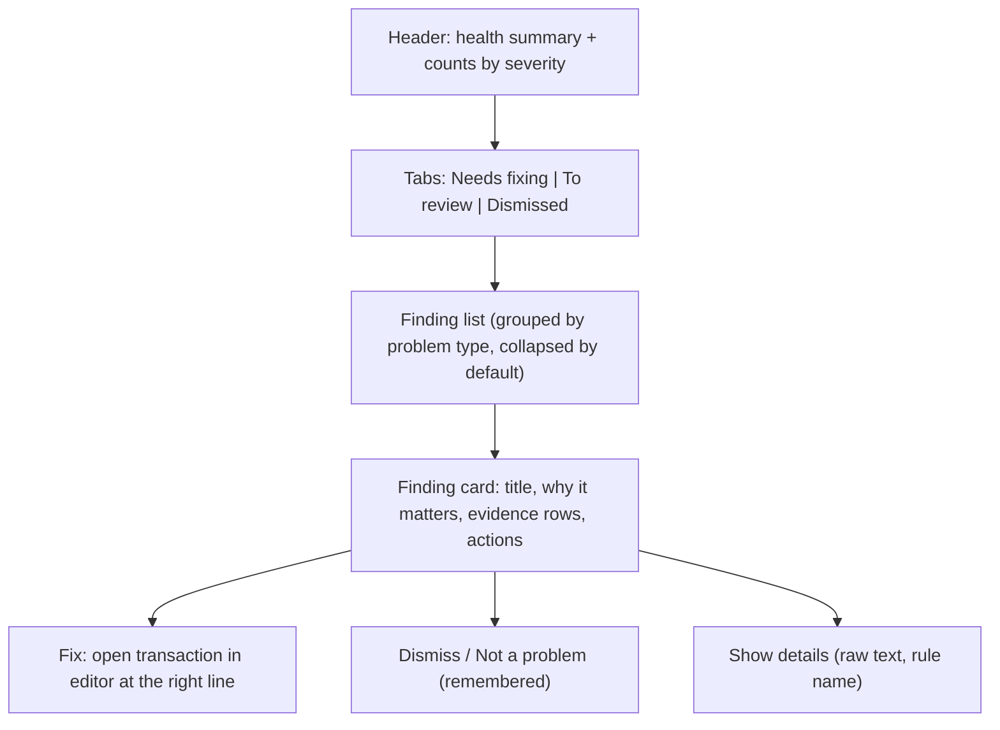

# Quick-Win Improvements Plan: Doctor Redesign, Dashboard Insights, Recurring Audit

Status: draft for review. Nothing is implemented. Findings below come from a partial read of the code, and each phase starts with a short verification step.

## Findings that shape this plan

- **Three Doctor pages with overlapping code.** `/more/doctor` (764 lines), `/more/doctor-v2` (965) and `/more/doctor-v3` (1279) total about 3,000 lines of UI. The first two both use the `$lib/doctor_v2` helpers. The Navbar links only "Doctor" and "Doctor V2". V3 is reachable only by URL.
- **Doctor findings are descriptive, not actionable.** The backend (`internal/server/doctor.go`) has six rules (negative asset balance, wrong-direction income/expense entries, missing or mismatched prices, assets missing from allocation targets). Each `Issue` is just `level`, a generic `description` and a `details` string that is the raw error text. Nothing says *what to do* or links to the entry to fix.
- **Duplicates and outliers are separate APIs.** `/api/diagnosis` (rules) and `/api/diagnosis/duplicates` (duplicates plus outliers, with a suppress endpoint). The pages merge them client-side.
- **Legacy `more/goals` and `more/tax` routes already redirect** (301) to `planning/*`. They are fine and need no cleanup beyond optional removal later.

## Phase A — Consolidate Doctor routes (small, do first)
1. Decide the keeper (see Phase B, the new design replaces all three).
2. Until then: add a redirect from `/more/doctor-v2` and `/more/doctor-v3` to the chosen page, and make the Navbar show a single "Doctor" entry with the issue-count badge.
3. Keep the shared `doctor_v2.ts` helpers and tests. Rename later once the redesign settles.
- **Tests:** existing `doctor_v2.test.ts` keeps passing. Add a route redirect check if the repo already tests redirects.

## Phase B — Doctor redesign: simple, understandable, fixable

### Design principles
1. **One list, one question:** "What is wrong, and how do I fix it?" Not three modes (cards, focus, grouping) with many filters.
2. **Plain language first.** Each finding has a short title, one-sentence explanation of why it matters, and the evidence (the specific entries). Technical text goes behind a "details" toggle.
3. **Every finding has an action.** Fix, dismiss, or open the entry.
4. **Progress is visible.** A health summary ("3 to fix, 5 to review, 12 dismissed") and a clear "all clear" state.
5. **Severity is meaningful:** *Fix* (data is wrong), *Review* (might be wrong), *Info* (optional improvement).

### Proposed layout

### Concrete changes
1. **Rule metadata with fix guidance (backend).** Extend each rule with `id`, `title`, `why_it_matters`, `how_to_fix` and `severity`, and give each finding structured evidence (posting/transaction ids, account, date, amount) rather than only a string. Keep the existing `description` and `details` fields for compatibility, and add the new ones alongside.
2. **Unified findings endpoint.** One `GET /api/doctor/findings` returning rule issues, duplicates and outliers in a single typed list, each with a `kind`, severity, evidence and available actions. The old endpoints stay until the old pages are removed.
3. **Deep links to fix.** Each evidence row links to the transaction in the ledger editor (using the existing editor navigation) or to the relevant page (Price page for missing prices, Allocation config for unassigned accounts).
4. **Dismiss with memory.** Reuse the existing duplicate-suppression mechanism and extend it to any finding, keyed by a stable fingerprint (rule id plus evidence ids), with an optional note and an "undo" in the Dismissed tab.
5. **Group, don't paginate.** Group by problem type ("12 transactions have the wrong direction"), expandable. Show the top few items per group with "show all". This replaces the search, page-size and confidence controls for most users. Advanced filters stay behind one "Filters" button.
6. **Bulk-friendly actions.** For duplicates: "Not a duplicate" on a whole group. For outliers: "Looks fine" per item or per payee.
7. **First-run clarity.** An empty state that explains what Doctor checks, so "no issues" feels meaningful.
8. **Accessibility and theme.** Reuse existing theme variables (the earlier dark-theme fixes), keyboard navigation for the list, and no information conveyed by color alone.

### Open to ideas (candidates, not committed)
- **"Fix assistant" for sign errors:** a one-click preview of the corrected entry before the user applies it in the editor.
- **Missing price quick-add:** a small inline form to enter the missing price directly.
- **Doctor as a weekly digest:** feeds the dashboard card in Phase C.
- **Severity learning:** auto-collapse groups the user has dismissed repeatedly.

### Delivery steps
1. B1 backend: rule metadata, structured evidence, unified endpoint, with Go tests per rule.
2. B2 frontend: new single page built from small components (`FindingCard`, `FindingGroup`, `HealthSummary`), replacing the three pages.
3. B3 dismissal generalization and undo.
4. B4 delete old pages and unused helpers once the new page is verified.
- **Tests:** Go unit tests for metadata and fingerprint stability, Bun tests for grouping and filtering helpers, regression fixtures for the new endpoint, and a manual walkthrough with seeded bad data.

## Phase C — Dashboard "Needs attention" widget
- A new widget in the existing customizable dashboard layout (`dashboard_layout`), enabled by default but removable.
- Content: top findings from the unified Doctor endpoint (count by severity, top 3 items with links), past-due recurring items, and budget overruns for the current month.
- Backend: one read-only summary endpoint that reuses existing computations. No new calculations.
- Empty state: a short "All good" line.
- **Tests:** endpoint test with fixture data, widget registration test, and a dashboard layout migration check so existing saved layouts pick up the new widget.

## Phase D — Life-plan status widget (gated on readiness)
- **Not ready to ship yet.** See "Life plan readiness" below. Build the widget only after the gate items pass.
- A dashboard widget showing the FIRE probability and median FIRE year from the existing simulation result, with a link to the Life Plan page. Hidden when no plan inputs exist.
- Read-only. Reuse the cached result, with no new simulation on dashboard load. Label it clearly as an estimate.
- **Tests:** summary mapping unit tests, and fixtures with and without a configured plan.

### Life plan readiness (assessment)
Looks good: the fan chart, FIRE probability and year-bands (p25/p50/p75), goal markers with per-goal probability, what-if, drawdown and projection caching are all in place and the UI is cohesive.

Gaps before it belongs on a dashboard:
1. **Core engine has no tests.** `docs/projection-task.md` still has unchecked items: `dna_test.go`, `simulator_test.go`, and the performance check (1000 iterations x 360 months under 500ms). The repo has tests only for `goals`, `whatif` and `drawdown`. Dashboard numbers need a tested simulator and a fixed random seed option for reproducible tests.
2. **Dashboard numbers must be stable.** The page simulates with random sampling, so the headline probability can change slightly between loads. A dashboard figure that flickers erodes trust. Use a fixed seed (or cached result tied to the sync version) for the widget.
3. **Defaults drive the answer.** The page starts from assumed return, volatility, inflation and withdrawal rate. The widget should show which assumptions it used, and link to adjust them.
4. **Data sufficiency.** The profile reports how many years of income, expense and price history it saw (`income_years_covered`, `price_months_covered`). Show "not enough history" instead of a number when coverage is thin.
5. **Expectation setting.** Add a short "estimate, not advice" note, and avoid red/green verdict language beyond what the page already uses (70% and 40% thresholds).

Gate: items 1, 2 and 4 are required, 3 and 5 are small additions to the widget itself.

## Phase E — Subscription and recurring audit
- On the recurring page, add a summary: total annual cost of recurring expenses, a list sorted by cost, and flags for "price changed", "missed last occurrence" and "possibly cancelled".
- Reuse the existing recurring detection and transaction sequences. Add only the aggregation and flag logic.
- **Tests:** unit tests for the flag logic with fixture sequences, covering price increase, skipped occurrence and stable cases.

## Phase F — Mobile quick-add polish
Verified so far: a `QuickAddModal` already exists (about 360 lines) with payee, from and to account fields, an amount and commodity, date, parsing through `/api/parser/parse`, and account suggestions with scores. Not yet verified: how it behaves on a phone.
- **Verify first:** open it at phone widths and note issues (tap targets, keyboard type for the amount, scrolling, suggestion list size).
- **Likely improvements:**
  - Numeric keypad for the amount (`inputmode="decimal"`), date defaulting to today, and large tap targets.
  - Recent and most-used payees and accounts as one-tap chips, so most entries need two or three taps.
  - "Repeat last transaction" and "save and add another".
  - Remember the last used from-account.
  - A persistent entry point on mobile (for example a floating add button), and an installable PWA shortcut if the app already registers a manifest.
  - Confirmation that shows the generated ledger entry before saving, with a clear error if it fails.
- **Tests:** unit tests for recent-payee ranking and default selection helpers. Manual walkthrough at 375px width.

## Phase G — One-click backup and export
Verified so far: there are price export and "delete backups" endpoints, and the editor keeps file backups. There is no single export that bundles everything.
- **Scope:** a "Download backup" action (Settings or More menu) that returns a zip containing the journal files, `paisa.yaml`, sheet files, and (when the inbox feature exists) the inbox journal. It excludes the cache DB, since it can be rebuilt, and excludes secrets such as password hashes unless the user opts in.
- **Safety:** the endpoint requires the normal auth, is read-only (so it works in readonly mode), streams the zip, never follows paths outside the configured journal and config directories, and records an audit log line.
- **Optional:** a "Restore preview" that lists what a zip contains, without applying it. Applying a restore is out of scope for the first version.
- **Tests:** Go tests that the archive contains exactly the expected files, excludes the DB and secrets, and rejects path traversal. Manual: download and open the zip.

## Suggested order and sizing

| Order | Phase | Size | Why |
| :--- | :--- | :--- | :--- |
| 1 | A: Consolidate Doctor routes | S | Removes confusion immediately |
| 2 | G: One-click backup/export | S | Independent, builds trust, low risk |
| 3 | B1–B2: Data Health backend metadata and new page | M–L | Main user-facing improvement |
| 4 | C: Needs attention widget | S–M | Reuses B1's unified endpoint |
| 5 | B3–B4: Dismissal and cleanup | S–M | Finishes the redesign |
| 6 | E: Recurring audit | S | Independent, quick value |
| 7 | F: Mobile quick-add polish | S–M | Daily-use improvement after a verification pass |
| 8 | D: Life-plan widget | S–M | Gated on the readiness items above |

## Cross-cutting requirements
- Update `CHANGELOG.md` per phase, and the Doctor reference docs.
- Regenerate regression fixtures (`make regen`) when API response shapes change.
- Go: `gofmt` plus the narrow `go test ./internal/server/...`. Frontend: Prettier on touched files, `npm run check`, and scoped ESLint.

## Risks
| Risk | Mitigation |
| :--- | :--- |
| Breaking the old Doctor API consumers | Keep old endpoints until the old pages are deleted |
| Dismissals lost or colliding | Stable fingerprints, tests, and an undo tab |
| Dashboard clutter | Widgets are removable and default to compact |
| Heavy dashboard load | Summary endpoint reuses cached data only |
| Scope creep on Doctor "ideas" | Ideas stay optional and are only added after B2 ships |

## Decisions recorded
1. The page is renamed **Data Health** (nav label and page title). Keep the `/more/doctor` URL working through redirects, and use the new name in the UI, docs and changelog.
2. The dashboard "Needs attention" widget **only renders when there are findings**. With no findings the widget is hidden and takes no space. It remains available in the customize list so users can still turn it off.
3. The **fix assistant is deferred** to a later release and is not part of the first Data Health release.

## Open questions
None blocking.
