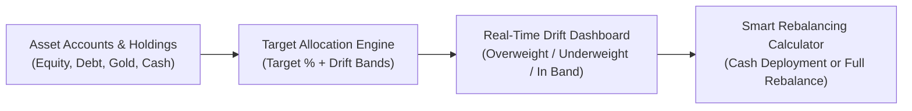

# Target Asset Allocation & Rebalancing

Asset allocation is the primary driver of portfolio risk and long-term investment performance. Paisa provides an interactive, UI-driven asset allocation system that lets you set target weights, monitor allocation drift in real-time, and calculate smart buy/sell rebalancing recommendations without editing configuration files.

---

## 1. Overview & Key Capabilities



* **100% UI-Managed Setup:** Build and adjust target asset classes directly from the browser with interactive account search, checkboxes, and live 100% balance validation.
* **Tolerance & Drift Corridors:** Set custom drift bands (e.g., $\pm 5\%$) per asset class. Visual status badges immediately highlight which buckets require attention.
* **Tax-Free Cash Deployment Rebalancing:** Enter your fresh monthly savings, and Paisa’s water-filling algorithm tells you exactly how much to inject into underweighted buckets without selling assets or triggering capital gains taxes.
* **Full Portfolio Rebalancing:** Calculate exact buy and sell orders needed across all buckets to restore target equilibrium.

---

## 2. Setting Up Allocation Targets via the UI

You do not need to edit text files or write YAML regex. You can manage your entire asset allocation visually:

1. Navigate to **Assets** $\rightarrow$ **Allocation** (`/assets/allocation`) from the left sidebar.
2. In the **Target Asset Allocation** card:
   * If you have no targets configured yet, click **Set Up Asset Targets**.
   * If you already have targets, click **Manage Targets** (⚙ icon) at the top right.

```
┌─────────────────────────────────────────────────────────────────────────────────┐
│  Asset Allocation Target Builder                        [ + Add Asset Class ]   │
├─────────────────────────────────────────────────────────────────────────────────┤
│  [ Equity (Domestic)           ]  Target: [ 50 ] %  Drift: [ ±5 ] %             │
│  Mapped Accounts: Assets:Equity:* [Edit Mappings] [Delete]                      │
│                                                                                 │
│  [ Fixed Income / Debt         ]  Target: [ 30 ] %  Drift: [ ±5 ] %             │
│  Mapped Accounts: Assets:Debt:*   [Edit Mappings] [Delete]                      │
│                                                                                 │
│  [ Gold & Commodities          ]  Target: [ 10 ] %  Drift: [ ±2 ] %             │
│  Mapped Accounts: Assets:Gold:*   [Edit Mappings] [Delete]                      │
│                                                                                 │
│  [ International Equity        ]  Target: [ 10 ] %  Drift: [ ±3 ] %             │
│  Mapped Accounts: Assets:Equity:US:* [Edit Mappings] [Delete]                   │
├─────────────────────────────────────────────────────────────────────────────────┤
│  Total Allocation: 100%  [✓ Balanced]                       [ Save Targets ]    │
└─────────────────────────────────────────────────────────────────────────────────┘
```

### Step-by-Step Configuration:

* **Asset Class Name:** Enter a label (e.g., `Domestic Equity`, `Fixed Income`, `Gold`, `Cash`).
* **Target Percentage (%):** Specify your target weight (e.g., `50`).
* **Drift Band (±%):** Specify the allowed tolerance (defaults to `±5%`). For example, a target of 50% with $\pm 5\%$ drift remains "In Band" between 45% and 55%.
* **Assigning Accounts:**
  * Click **+ Select Accounts** to open the account picker.
  * Search and toggle checkboxes for existing accounts (e.g., `Assets:Equity:MutualFunds`, `Assets:Debt:FixedDeposits`).
  * Or type a wildcard pattern (e.g., `Assets:Equity:*`) and click **Add** to match all sub-accounts.
* **Total Balance Tracker:** The progress bar dynamically verifies that your allocations total **100%**. It turns green when balanced and alerts you if allocations are under or over 100%.
* Click **Save Targets**. Paisa automatically saves the configuration and instantly refreshes the charts.

---

## 3. Monitoring Portfolio Drift

Once targets are saved, the **Target Asset Allocation** dashboard displays:

### Status Badges & Drift Indicators
Each asset class displays its current valuation, actual weight, target weight, and drift delta ($\Delta = \text{Actual \%} - \text{Target \%}$):

| Status Badge | Condition | Description |
| :--- | :--- | :--- |
| **In Band (Green)** | $|\Delta| \le \text{Drift Band}$ | Allocation is within your target tolerance corridor. |
| **Overweight (Amber)** | $\Delta > +\text{Drift Band}$ | Asset class has expanded beyond the upper band. |
| **Underweight (Blue)** | $\Delta < -\text{Drift Band}$ | Asset class has fallen below the lower band. |

### Visual Charts
* **Treemap & Target Comparison:** Shows target proportions alongside current market values.
* **Allocation Timeline:** Shows how your asset distribution has evolved over time.
* **Allocation Table:** Complete breakdown of leaf accounts, market values, and percentage shares.

---

## 4. Using the Smart Rebalancing Calculator

Directly below the allocation charts, the **Portfolio Rebalancing Engine** card provides real-time guidance on what to buy or sell:

```
┌─────────────────────────────────────────────────────────────────────────────────┐
│ ⚖️ Portfolio Rebalancing Engine                                                  │
│ [💧 Cash Deployment (Buy Only)]   [🔄 Full Rebalance (Buy & Sell)]              │
├─────────────────────────────────────────────────────────────────────────────────┤
│ Fresh Investable Cash: [ 50000        ]  [+10k] [+50k] [+100k] [Reset]          │
├─────────────────────────────────────────────────────────────────────────────────┤
│ Asset Class       Target %   Current %   Current Value   Action Required  New % │
│ Equity            50.0%      58.0%       ₹5,80,000       [ HOLD ]         52.7% │
│ Debt              30.0%      25.0%       ₹2,50,000       [ BUY ₹35,000 ]  26.0% │
│ Gold              10.0%       8.0%         ₹80,000       [ BUY ₹15,000 ]   8.6% │
│ Cash              10.0%       9.0%         ₹90,000       [ HOLD ]          8.2% │
├─────────────────────────────────────────────────────────────────────────────────┤
│ Portfolio Total: ₹10,000,000 ➔ Projected: ₹10,050,000                           │
└─────────────────────────────────────────────────────────────────────────────────┘
```

### Mode 1: Cash Deployment (Buy Only / No Tax)
* **Best for:** Monthly savings, systematic investments, or deploying lump-sum bonuses.
* **How it works:** Instead of forcing you to sell existing holdings (which can trigger capital gains taxes and exit loads), this mode uses a **water-filling algorithm**:
  * It identifies which buckets are below their target weights.
  * It distributes your fresh cash strictly into underweighted buckets in proportion to their deficits.
  * Buckets that are already overweight receive **HOLD** (zero cash).
* **Presets:** Use the quick-add buttons (`+10k`, `+50k`, `+100k`) to quickly simulate deploying different amounts.

### Mode 2: Full Rebalance (Buy & Sell)
* **Best for:** Periodic portfolio reviews (e.g., annual or semi-annual rebalancing).
* **How it works:** Computes the exact trades needed to reset the portfolio to exact target weights:
  * Trims overweighted assets with a **SELL** action.
  * Reallocates proceeds to underweighted assets with a **BUY** action.

---

## 5. Configuration File Reference (`paisa.yaml`)

While you can manage everything directly through the UI, target configurations can also be inspected or version-controlled in `paisa.yaml` under `allocation_targets`:

```yaml
allocation_targets:
  - name: Domestic Equity
    target: 50
    drift: 5
    accounts:
      - "Assets:Equity:India:*"
      - "Assets:MutualFunds:LargeCap:*"

  - name: Fixed Income
    target: 30
    drift: 5
    accounts:
      - "Assets:Debt:*"
      - "Assets:FixedDeposits:*"

  - name: International Equity
    target: 10
    drift: 3
    accounts:
      - "Assets:Equity:US:*"

  - name: Gold & Commodities
    target: 10
    drift: 2
    accounts:
      - "Assets:Gold:*"
      - "Assets:Commodities:*"
```

### Field Definitions:

* **`name`** *(string, required)*: Descriptive name of the asset class.
* **`target`** *(number, required)*: Desired target weight percentage ($0 \le \text{target} \le 100$).
* **`drift`** *(number, optional)*: Allowed drift corridor percentage (defaults to `5` if omitted).
* **`accounts`** *(array of strings, required)*: Account names or wildcard glob patterns included in this bucket.
* **`commodities`** *(array of strings, optional)*: Specific commodity tickers to filter or restrict to within this target.
