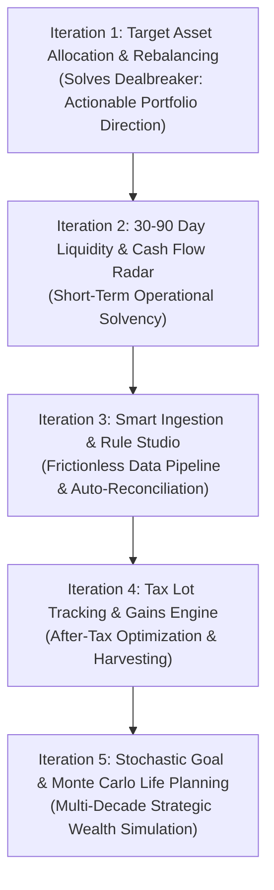

# Paisa Product Roadmap: Iterative Implementation Plan

> **Vision:** Transform Paisa from a historical recording and visualization tool into an **active personal wealth decision engine**, while retaining 100% local-first privacy, double-entry mathematical rigor, and plain-text sovereignty.

---

## Roadmap Architecture & Iteration Strategy

Each iteration is structured to deliver immediate, standalone end-user value while establishing reusable backend and frontend primitives for subsequent phases.



---

## Iteration 1: Target Asset Allocation & Rebalance Engine
**Theme:** *Turn portfolio tracking into actionable investment decisions.*

```
Value Delivered: The user visually builds their target asset allocation in the UI (no config file editing), monitors allocation drift in real-time, and uses a smart cash deployment calculator to know exactly where to invest fresh capital.
```

### 1.1 Scope & User Deliverables
* **100% UI-Driven Allocation Builder (`/assets/allocation` or Dedicated Settings Modal):**
  * Visual target weight builder with interactive sliders/inputs.
  * Live 100% total balance validator with color status (green when balanced, alerts when over/under).
  * Point-and-click account and commodity tree picker (no manual YAML/glob typing).
  * Unassigned asset detection banner alerting users when new accounts/commodities need mapping.
  * Customizable drift tolerance bands (e.g. Target $\pm 5\%$).
  * Visual hybrid/multi-asset fund split configurator (e.g. 60% Equity / 40% Debt).
  * Direct persistence via backend API with zero manual YAML file editing.
* **Allocation & Drift Dashboard (`/assets/allocation`):**
  * Current vs. Target side-by-side comparative visualizer (donut & horizontal drift-bar charts).
  * Color-coded drift indicators (Green: within band, Amber/Red: drift exceeded).
* **Smart Cash Rebalancing Calculator:**
  * **"New Cash Deployment" Mode (No-Tax):** Input available investable cash (e.g., \$2,000 / ₹1,50,000); computes exact buy allocations targeting underweighted buckets without selling assets.
  * **"Full Rebalance" Mode:** Computes the minimum necessary buy and sell orders to restore exact target equilibrium.

### 1.2 Technical Touchpoints
* **Backend:**
  * Model/Config: Enhance `AllocationTarget` in [`internal/config/config.go`](file:///d:/Git/paisa/paisa/internal/config/config.go) to support `Drift` tolerance and commodity mappings.
  * Service: `internal/service/rebalance.go` computing current weights from commodity valuations, calculating drift delta, and solving the non-negative cash allocation algorithm.
  * API: `GET /api/allocation`, `POST /api/allocation/targets` (or config persistence), `POST /api/allocation/rebalance`.
* **Frontend:**
  * SvelteKit Route: `src/routes/(app)/assets/allocation/+page.svelte`.
  * Components: `AllocationTargetEditorModal.svelte`, `AssetMappingPicker.svelte`, `DriftBarChart.svelte`, `CashRebalanceCalculator.svelte`.

---

## Iteration 2: 30–90 Day Liquidity & Cash Flow Radar
**Theme:** *Eliminate day-to-day cash flow anxiety and prevent account shortfalls.*

```
Value Delivered: Proactively forecasts operating account balances over the next 3 months, highlighting upcoming cash shortfalls or low-balance risks before automatic bill debits, EMIs, or investment SIPs trigger.
```

### 2.1 Scope & User Deliverables
* **Recurring Pattern Detection & Periodic Registry:**
  * Automatic detection of recurring income/expenses based on historical transaction frequency and payee patterns.
  * Support for Ledger's periodic transactions syntax (`~ monthly`, `~ every 15th`) or UI-managed recurring schedules.
* **Cash Flow Runway Calendar (`/cash_flow/radar`):**
  * Interactive 30/60/90-day forward timeline plotting expected inflows (paychecks, dividends, interest) and outflows (rent, utility bills, EMIs, insurance, scheduled SIPs).
* **Account-Level Balance Projections:**
  * Daily projected balance curves for liquid accounts (`Assets:Bank:*`, `Assets:Cash`).
  * **Low-Balance Warning System:** Configurable minimum balance thresholds that trigger alerts if an upcoming debit is projected to cause an overdraft or minimum-balance fee.

### 2.2 Technical Touchpoints
* **Backend:**
  * Service: `internal/service/forecast.go` to parse recurring transaction rules, calculate forward running balances per liquid account, and detect collision dates.
  * API: `GET /api/v1/cashflow/radar?days=90`.
* **Frontend:**
  * SvelteKit Route: `src/routes/(app)/cash_flow/radar/+page.svelte`.
  * Components: `LiquidityTimeline.svelte`, `BalanceProjectorChart.svelte`, `UpcomingCommitmentsList.svelte`.

---

## Iteration 3: Smart Statement Ingestion & Visual Rule Studio
**Theme:** *Reduce maintenance friction from hours to minutes.*

```
Value Delivered: Drag-and-drop bank CSVs, broker statements, or mutual fund CAS into Paisa; automatically normalize, categorize, and deduplicate entries with a visual rule engine before appending to ledger files.
```

### 3.1 Scope & User Deliverables
* **Dropzone Ingestion Hub (`/more/import`):**
  * Unified parser pipeline supporting CSV, OFX/QFX, and Indian Consolidated Account Statements (CAS - CAMs / KFintech).
  * Auto-detection of column mapping presets (customizable and savable per bank/broker).
* **Visual Rule Studio:**
  * Rule criteria based on Payee regex, Narration substring, Amount range, and Date patterns.
  * Actions: Auto-assign posting account (e.g. `Expenses:Dining`), append tags (e.g. `#tax-deductible`), or flag for review.
* **Interactive Reconciliation & Staging Table:**
  * Side-by-side preview showing matched existing transactions vs. new candidates.
  * Duplicate detection scoring to avoid double-posting cross-account transfers.
  * "1-Click Append to Ledger" writing cleanly formatted transactions directly to the configured `.ledger` file.

### 3.2 Technical Touchpoints
* **Backend:**
  * Importer packages: `internal/importer/{csv, ofx, cas}`.
  * Rule Engine: `internal/service/rules.go` evaluating conditions and generating proposed postings.
  * API: `POST /api/v1/import/parse`, `POST /api/v1/import/commit`, `GET /api/v1/rules`.
* **Frontend:**
  * SvelteKit Route: `src/routes/(app)/more/import/+page.svelte`.
  * Components: `StatementDropzone.svelte`, `TransactionStagingGrid.svelte`, `RuleEditorModal.svelte`.

---

## Iteration 4: Tax Lot Accounting & Capital Gains Engine
**Theme:** *Tax-aware wealth preservation and year-end optimization.*

```
Value Delivered: Clear visibility into realized and unrealized capital gains segmented into Short-Term vs. Long-Term buckets, with specific tax-loss harvesting recommendations before financial year-end.
```

### 4.1 Scope & User Deliverables
* **Tax Lot Engine (FIFO / HIFO / Specific ID):**
  * Matches commodity buy lots with disposal events from ledger postings to track accurate purchase date, cost basis, and holding tenure.
* **Jurisdiction-Aware Tax Configuration:**
  * Configurable holding period thresholds (e.g., Equity: 12 months for LTCG, Debt/Real Estate: 24/36 months).
  * Configurable grandfathering / cost inflation index (CII) options where applicable.
* **Capital Gains & Harvesting Dashboard (`/planning/tax`):**
  * **Realized Gains Summary:** Comprehensive annual tax report breaking down STCG vs. LTCG for tax filing.
  * **Unrealized Gains & Lot Ageing:** Visual aging breakdown (days remaining until lot converts from STCG to LTCG).
  * **Tax-Loss Harvesting Assistant:** Filterable list of underwater lots with calculated tax-offset potential against realized short-term gains.

### 4.2 Technical Touchpoints
* **Backend:**
  * Accounting Core: `internal/accounting/taxlot.go` implementing lot matching queues and cost-basis algorithms.
  * Service: `internal/service/tax.go` computing jurisdiction-specific capital gains brackets.
  * API: `GET /api/v1/tax/gains?year=2026`, `GET /api/v1/tax/harvesting-candidates`.
* **Frontend:**
  * SvelteKit Route: `src/routes/(app)/planning/tax/+page.svelte`.
  * Components: `TaxReportSummary.svelte`, `LotAgeingTable.svelte`, `HarvestingCandidateCard.svelte`.

---

## Iteration 5: Stochastic Life & Goal Planning (Monte Carlo Simulation)
**Theme:** *Resilient, probability-based multi-decade financial planning.*

```
Value Delivered: Simulates portfolio longevity across thousands of market scenarios, testing sequence of returns risk, variable inflation shocks, and milestone goal achievement with clear probability-of-success metrics.
```

### 5.1 Scope & User Deliverables
* **Goal Earmarking & Multi-Bucket Portfolio:**
  * Earmark specific investment accounts or commodities to specific life goals (e.g., *House Downpayment 2028*, *Kid's College 2035*, *FI/RE Retirement Corpus*).
  * Target date glidepaths that suggest de-risking (equity $\rightarrow$ fixed income) as goal horizons shorten.
* **Monte Carlo Simulation Engine (`/planning/monte_carlo`):**
  * Runs 5,000+ stochastic market paths based on historical asset class volatility, correlation matrices, and inflation variances.
  * Computes **Probability of Success ($P_{success}$)** curves (10th, 50th, 90th percentile net worth trajectories).
* **Dynamic Withdrawal & Stress-Testing Simulator:**
  * Test Safe Withdrawal Rates (SWR: 3.0%, 3.5%, 4.0%) against historical crises (e.g., 2000 Dot-com crash, 2008 GFC, 1970s Stagflation).
  * Dynamic spending guardrails (Guyton-Klinker rules) to visualize how small spending adjustments preserve corpus survival.

### 5.2 Technical Touchpoints
* **Backend:**
  * Simulation Engine: `internal/service/montecarlo.go` (Go routines for parallelized multi-path stochastic distribution calculation).
  * API: `POST /api/v1/planning/simulate/monte-carlo`.
* **Frontend:**
  * SvelteKit Route: `src/routes/(app)/planning/monte_carlo/+page.svelte`.
  * Components: `MonteCarloFanChart.svelte`, `GoalGlidepathCard.svelte`, `StressTestScenarioSelector.svelte`.

---

## Iteration Summary Matrix

| Iteration | Primary Focus | Key Persona Question Answered | Delivery Artifacts |
| :--- | :--- | :--- | :--- |
| **1** | **Asset Allocation & Rebalancing** | *"Where should I deploy my monthly \$2,000 surplus right now?"* | Target config, drift monitor, no-tax cash allocator |
| **2** | **Liquidity & Cash Flow Radar** | *"Will my bank balance handle all bills, EMIs, and SIPs this month?"* | 90-day forward timeline, shortfall alerts, balance curves |
| **3** | **Smart Statement Ingestion** | *"How can I get my monthly transactions into Paisa in 2 minutes?"* | Drag-and-drop CSV/CAS hub, Visual Rule Studio, dedup engine |
| **4** | **Tax Lots & Capital Gains** | *"What are my taxable gains and can I harvest losses before March/Dec?"* | FIFO/HIFO lot tracker, STCG/LTCG report, harvesting scanner |
| **5** | **Stochastic Goal & Life Plan** | *"Will my portfolio survive 40 years of retirement through market shocks?"* | Monte Carlo simulation, goal glidepaths, stress tests |
